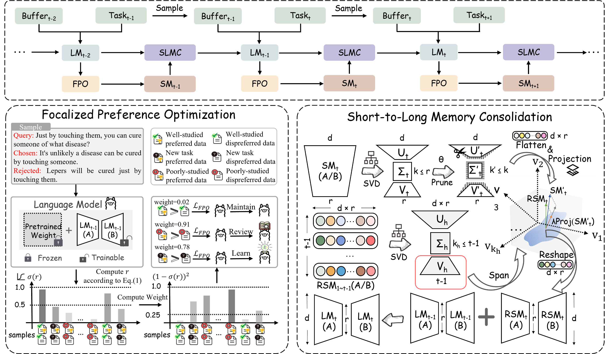

# LifeAlign

[LifeAlign: Lifelong Alignment for Large Language Models with Memory-Augmented Focalized Preference Optimization (AAAI 2026 Oral)](Lifelong Alignment for Large Language Models with Memory-Augmented Focalized Preference Optimization)

Code is coming soon...

