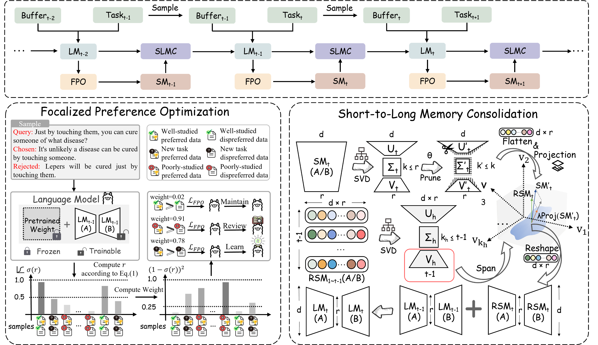

# LifeAlign


=======
Official codebase for the paper [LifeAlign: Lifelong Alignment for Large Language Models with Memory-Augmented Focalized Preference Optimization](https://arxiv.org/abs/2509.17183).

This project is built on top of LlamaFactory and extends its DPO/SFT training pipeline for lifelong alignment. Following the paper, the implementation centers on two ideas:

- Focalized Preference Optimization (FPO): Adaptively allocates learning intensity based on sample difficulty during the preference optimization process.
- Short-to-Long Memory Consolidation (SLMC): Denoises task-specific updates and projects them into a stable long-term memory space to reduce forgetting.

At the code level, the main components are:

- `src/llamafactory/train/dpo/MyDPOTrainer.py`: FPO-style preference loss.
- `src/llamafactory/train/dpo/CL_methods/CLManager.py`: memory consolidation with denoising and subspace projection.
- `src/llamafactory/train/dpo/BaseTrainerCL.py`: continual training pipeline and the built-in SFT initialization stage.

## Environment Setup

Because this repo is based on LlamaFactory, the environment preparation can largely follow the standard LlamaFactory setup.

### 1. Create a Python environment

```bash
conda create -n lifealign python=3.10 -y
conda activate lifealign
pip install --upgrade pip
```

### 2. Install PyTorch

Please install the PyTorch version that matches your local CUDA version first. The following example installs torch 2.6.0 with CUDA 11.8:

```bash
pip install torch==2.6.0 torchvision==0.21.0 torchaudio==2.6.0
```

Please choose the appropriate PyTorch version according to your CUDA version. The recommended PyTorch version for this project is 2.3.0 ~ 2.7.1.

### 3. Install this project

```bash
pip install -e ".[metrics]"
```

If you want to use DeepSpeed, install the optional dependency as well:

```bash
pip install -e ".[deepspeed]"
```

After installation, the main entry point is:

```bash
llamafactory-cli train ...
```

## Data Format

The datasets used in this repo are registered in `data/dataset_info.json`. The current continual alignment setup includes:

- `Capybara-Preferences`
- `HC3`
- `hh-rlhf-harmless-base`
- `hh-rlhf-helpful-base`
- `safe-rlhf`
- `TruthfulQA`

Each task also has corresponding `-sft` and `-test-sft` variants for initialization and evaluation.

## Training and Evaluation

This repo supports three launch modes.

### 1. Fully automated script via `bash.sh`

`bash.sh` runs the whole pipeline automatically:

- builds the task sequence
- launches alignment training
- evaluates the resulting adapter on current and previous tasks

Run it with:

```bash
bash bash.sh
```

You can adjust the following fields in `bash.sh` before running:

- `ORDER`: task order such as `order1`, `order2`, `order3`
- `GPU_ID`
- `MODEL_NAME` / `MODEL_PATH`
- `BASE_ADAPTER_PATH`
- `BASE_OUTPUT_DIR`

The repo also includes:

- `bash-MTL.sh`: multi-task baseline
- `bash-Sep.sh`: single-task / separate-task baseline
- `predict.sh`: prediction-only evaluation script

Important:

- The current `bash.sh` is a runnable automation template in this repo.
- If you want to explicitly reproduce the LifeAlign-style setting from the paper, pay attention to arguments such as `--CL_method`, `--loss_func`, `--use_replay`, `--denoising_threshold`, and `--projection_gamma`.


### 2. Launch with a YAML config file

You can also run training by passing a YAML file directly:

```bash
llamafactory-cli train examples/train_lora/llama3_lora_dpo.yaml
```

Or prepare your own YAML and run:

```bash
llamafactory-cli train /path/to/your_config.yaml
```

The repo already contains several examples under `examples/train_lora/`, such as:

- `examples/train_lora/llama3_lora_dpo.yaml`
- `examples/train_lora/llama3_lora_sft.yaml`
- `examples/train_lora/llama3_lora_sft_initialize.yaml`

## Built-in SFT Initialization

`examples/train_lora/llama3_lora_sft_initialize.yaml` is the configuration file for SFT initialization.

In the current implementation, this step is built into the code path:

- every continual alignment training job first performs SFT initialization
- then the alignment stage starts

This means the initialization is not merely an optional example YAML; it is part of the actual training pipeline.

If you want to modify:

- the base model
- template
- LoRA target modules
- datasets used in initialization
- output path
- batch size, learning rate, or other SFT hyperparameters
- dataset

you need to edit:

- `examples/train_lora/llama3_lora_sft_initialize.yaml`

before launching training.

## Output Structure

Typical outputs are:

- `saves/...`: checkpoints and LoRA adapters
- `save_test/...`: prediction and evaluation results

For continual learning runs, each task usually has its own subdirectory under the main output directory.

## Notes

- This repo inherits most training conventions from LlamaFactory.
- Multi-GPU training can be launched directly with `llamafactory-cli train`; LlamaFactory will invoke distributed training automatically when multiple devices are visible.
- Before large-scale experiments, it is recommended to first check model path, dataset registration, template name, and output directory settings.

## Citation

If you find this project useful, please cite the paper:

```bibtex
@inproceedings{li2026lifealign,
  title={Lifealign: Lifelong alignment for large language models with memory-augmented focalized preference optimization},
  author={Li, Junsong and Zhou, Jie and Zhan, Bihao and Yang, Yutao and Pan, Qianjun and Chen, Shilian and Huai, Tianyu and Li, Xin and Chen, Qin and He, Liang},
  booktitle={Proceedings of the AAAI Conference on Artificial Intelligence},
  volume={40},
  number={37},
  pages={31618--31626},
  year={2026}
}
```
